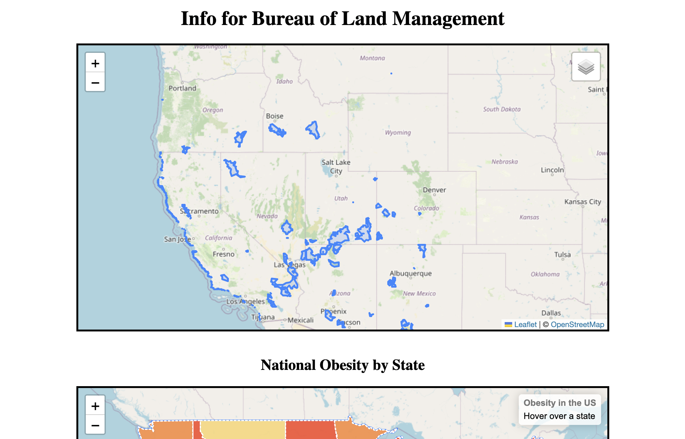

# NASA Space Apps Challenge: Mapping Data for Societal Benefit

An interactive series of maps created using LeafletJS, JavaScript, CSS and HTML

Live Demo: https://pdimaano.github.io/NASA_mapping/

